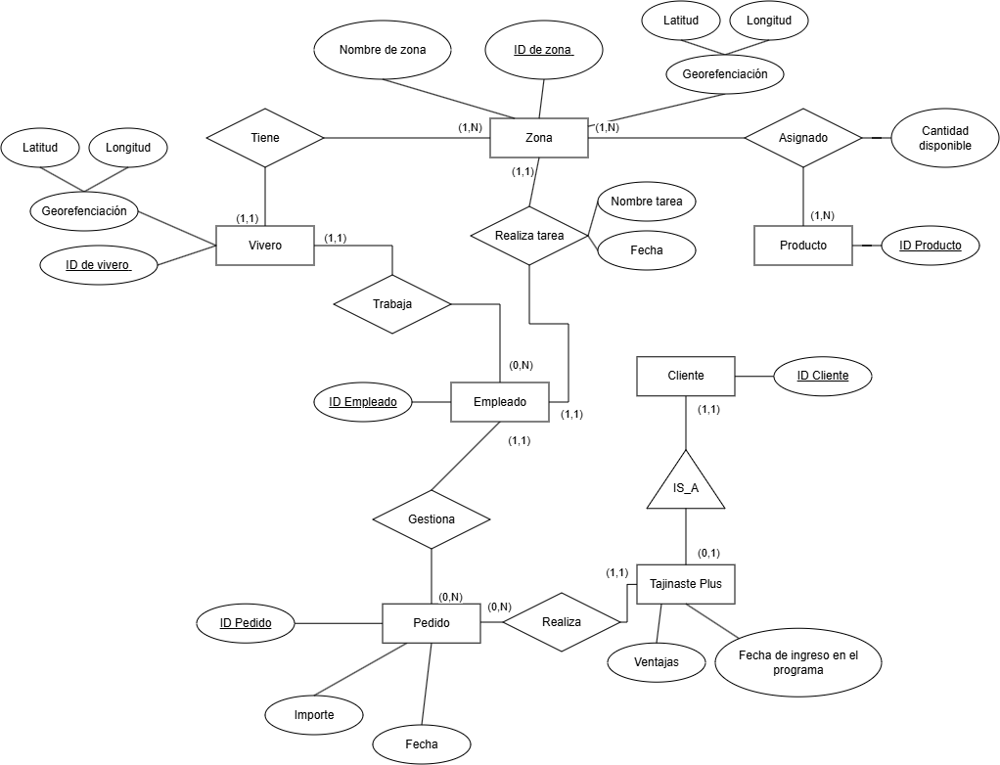
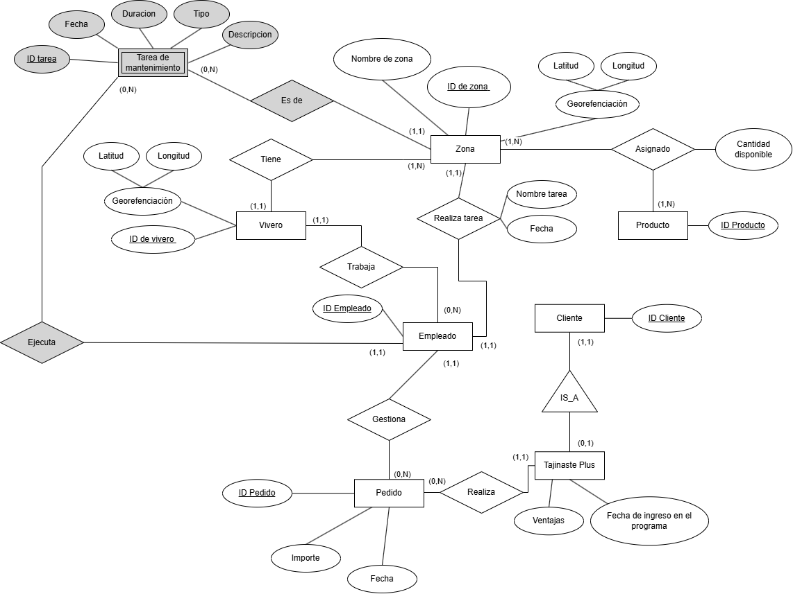

# ADBD-Practica2

## Diagrama

## Entidades
- Cliente: Representa a un cliente de Tajinaste S.A. Tiene un atributo identificador.
- Tajinaste Plus:  Representa a un cliente de Tajinaste S.A que pertenece al programa Tajinaste Plus. Tiene de atributos las ventajas con las que cuenta y la fecha de ingreso al programa.
- Pedido: Representa un pedido de un cliente de Tajinaste Plus. Cuenta con un atributo identificador, importe del pedido y la fecha.
- Empleado: Representa a un empleado de Tajinaste S.A. Tiene un atributo identificador.
- Vivero: Representa a un vivero. Tiene un atributo identificador y un atributo compuesto georreferenciación, que se compone de una latitud y una longitud. La georreferenciación no se usa como clave primaria porque puede ser (19.4326, -99.1332). Aunque tenga la precisión necesaria para distinguir zonas cercanas dependiendo de los decimales, es difícil de recordar cada decimal; y si escriben 19.43260 y se compara mal el float (o la cadena si está codificada como cadena), a lo mejor no va.
- Zona: Representa una zona de un vivero. Tiene un atributo identificador, un atributo de nombre y un atributo compuesto georreferenciación, que se compone de una latitud y una longitud.
- Producto: Representa un producto. Tiene un atributo identificador.

## Relaciones
- Asignado (Producto, Zona): Un producto es asignado a una o varias zonas. Una zona tiene uno o más productos asignados. Se tiene en cuenta qué cantidad de unidades de cada producto quedan disponibles en cada zona a la que hayan sido asignados.
- Tiene (Vivero, Zona): Un vivero tiene una o varias zonas. Una zona pertenece a un vivero.
- Trabaja (Empleado, Vivero): Un empleado trabaja en un vivero. Un vivero tiene cero o varios empleados.
- IS_A (Tajinaste Plus, Cliente): Una jerarquía parcial en la que un Tajinaste Plus es un cliente. Un cliente puede ser o no un Tajinaste Plus.
- Realizar Tarea (Empleado, Zona): En una zona cero o varios empleados pueden realizar una tarea con nombre y fecha. Cero o más empleados realizan tareas en una zona.
- Gestiona (Empleado, Pedido): Un empleado gestiona cero o más pedidos. Un pedido es responsabilidad (es gestionado) por un solo empleado.
- Realiza (Pedido, Tajinaste Plus): Un cliente Tajinaste Plus realiza cero o más pedidos. Cero o más pedidos pueden ser realizados por un Tajinaste Plus

## Modificación

## Autores

**Andrés David Riera Rivera**  
**Alejandro Feo Martín**
